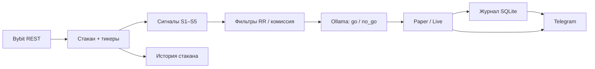

# ProScalp

Автоскальп Bybit по playbook **S1–S5**: стакан → сигналы → решение ИИ → paper/live → журнал. Управление и уведомления через Telegram.

Бот не «угадывает рынок» — он формализует правила из `data/playbook/`: лимитная плотность, импульс, короткий стоп, быстрый выход без импульса. Сделки проходят механические фильтры (комиссия, RR, возраст плотности), затем финальное одобрение даёт Ollama Cloud.

---

## Что делает программа



| Этап | Модуль | Описание |
|------|--------|----------|
| Данные | `app/bybit_client.py`, `app/orderbook_store.py` | Стакан perp + spot, тикеры, свечи; снимки пишутся в SQLite |
| Плотность | `app/density.py`, `app/wall_tracker.py` | Поиск ЛП, возраст, доля глубины, антиспуфинг |
| Сигналы | `app/signals.py` | S2 от плотности, S4 continuation, S5 drain-short и др. |
| Риск | `app/risk.py` | Размер от стопа, дневной лимит, паузы, серия убытков |
| Исполнение | `app/paper.py`, `app/paper_exec.py` | Paper-сделки в журнал; выход по playbook + LLM |
| ИИ | `app/ai.py` | Одобрение входа, ведение позиции, выбор watchlist |
| Telegram | `app/telegram_bot.py` | Команды, уведомления (MarkdownV2), диалог с ИИ |
| Надёжность | `app/watchdog.py`, `app/logging_setup.py` | Сторож зависаний, логи с flush, автоперезапуск |

**Цикл:** торговый скан (сигналы + ИИ + paper) — пауза `CYCLE_INTERVAL_SEC` (по умолчанию **30 с**), сам проход ~5–10 с. Стакан в SQLite пишется **отдельно каждые ~15 с** (фон).

---

## Установка

### Требования

- **Python 3.11+** (в проекте используется 3.12)
- Аккаунт **Bybit** (API key/secret; testnet или mainnet)
- **Telegram Bot** ([@BotFather](https://t.me/BotFather)) и ваш `chat_id`
- **Ollama Cloud** — API key и модель (по умолчанию `gemma4:cloud`)
- Опционально: HTTP(S)-прокси, если прямой доступ к Bybit/Telegram/Ollama недоступен

### Шаги

```bash
git clone <repo-url> proscalp && cd proscalp

python3 -m venv .venv
.venv/bin/pip install -r requirements.txt

cp .env.example .env
# Заполните .env — секреты не коммитятся
```

Минимально нужны:

```env
TELEGRAM_BOT_TOKEN=...
TELEGRAM_CHAT_ID=...
BYBIT_API_KEY=...
BYBIT_API_SECRET=...
OLLAMA_API_KEY=...
```

### Проверка

```bash
# Разовый smoke: Bybit + Ollama + один скан + сообщение в Telegram
PYTHONPATH=. .venv/bin/python scripts/smoke_test.py

# Тесты
PYTHONPATH=. .venv/bin/python -m pytest -q
```

### Запуск

```bash
# Один процесс (для отладки)
PYTHONPATH=. PYTHONUNBUFFERED=1 .venv/bin/python -m app

# Локально/в tmux: супервизор с автоперезапуском при зависании
chmod +x scripts/run_bot.sh
./scripts/run_bot.sh
```

Логи: `logs/proscalp.log` (ротация), `logs/supervisor.log`.

**На сервере** — systemd вместо супервизора: юнит и пошаговая инструкция в [`deploy/README.md`](deploy/README.md). Требования скромные: ~45 МБ RSS, одного ядра и 512 МБ хватает с запасом.

---

## Режимы

| Режим | Переменная | Поведение |
|-------|------------|-----------|
| **Paper** (по умолчанию) | `MODE=paper` | Сделки только в журнале; реальные ордера не выставляются |
| **Live** | `MODE=live` | Баланс читается с Bybit; исполнение ордеров — в разработке |

Переключение в рантайме: `/mode paper` или `/mode live` в Telegram (нужен **перезапуск** процесса).

**Данные рынка:** при `BYBIT_TESTNET=true` ордера идут на testnet, но стакан testnet синтетический — по умолчанию `MARKET_DATA_MAINNET=true` берёт **стакан и тикеры с mainnet**, а торговый аккаунт остаётся testnet.

---

## Playbook: сетапы S1–S5

Подробности — в `data/playbook/SETUPS.md`. В коде сейчас активны:

| ID | Смысл | Когда |
|----|-------|-------|
| **S2** `S2_false_breakout_density` | Отскок от лимитной плотности | Боковик, отстоявшаяся ЛП, цена подошла к уровню |
| **S4** `S4_active_continuation` | Продолжение по «горячей» монете | Сильный суточный ход, импульс в сторону тренда |
| **S5** `S5_drain_short` | Шорт слива после вертикали | Post-listing / drain, вход от отскока, не с дна |

**S1** (истинный пробой) и **S3** (flip при разъедании) описаны в playbook; детекторы добавляются по мере готовности.

**Выход из сделки:** первый импульс → BE; стоп; снятие/перенос плотности; окно без импульса (`MAX_SECONDS_WITHOUT_IMPULSE`); решение LLM (`hold` / `flatten` / `be`).

---

## Telegram

Сообщения бота — **MarkdownV2** (жирный текст, моноширинные блоки). При ошибке разметки тот же текст уходит повторно без форматирования.

| Команда | Действие |
|---------|----------|
| `/status` | Режим, эквити, риск, журнал, watchlist |
| `/balance` | Баланс paper или live |
| `/mode` | Показать режим; `/mode paper` / `/mode live` |
| `/watchlist` | Текущие символы |
| `/scan` | Один торговый цикл вручную |
| `/pause` | Мягкая пауза на 2 часа |
| `/resume` | Снять паузы |
| `/help` | Список команд |
| Любой текст | Диалог с ИИ в контексте стратегии |

Polling и обработка команд идут в **разных потоках** — медленный ответ ИИ не блокирует приём новых сообщений.

---

## Параметры `.env`

Полный шаблон — `.env.example`. Группы:

### Секреты и подключения

| Переменная | По умолчанию | Назначение |
|------------|--------------|------------|
| `TELEGRAM_BOT_TOKEN` | — | Токен бота |
| `TELEGRAM_CHAT_ID` | — | ID чата (только он может управлять) |
| `BYBIT_API_KEY` / `BYBIT_API_SECRET` | — | Ключи API |
| `BYBIT_TESTNET` | `true` | Testnet vs mainnet для аккаунта |
| `OLLAMA_API_KEY` | — | Ключ Ollama Cloud |
| `OLLAMA_MODEL` | `gemma4:cloud` | Модель для решений |
| `OLLAMA_HOST` | `https://ollama.com` | Базовый URL API |
| `PROXY_URL` | — | Единый прокси для всех HTTP-клиентов |
| `HTTP_PROXY` / `HTTPS_PROXY` / `NO_PROXY` | — | Альтернатива раздельным прокси |

### Рантайм и риск

| Переменная | По умолчанию | Назначение |
|------------|--------------|------------|
| `MODE` | `paper` | `paper` или `live` |
| `DEPOSIT_USDT` | `100` | Депозит для расчёта риска (paper) |
| `LEVERAGE` | `3` | Плечо (лимит номинала) |
| `RISK_PER_TRADE_PCT` | `0.5` | Риск на сделку, % от депозита |
| `DAILY_LOSS_LIMIT_PCT` | `2.0` | Жёсткий дневной стоп; при 50% — мягкая пауза 2 ч |
| `MAX_PARALLEL_SYMBOLS` | `2` | Макс. одновременных позиций |
| `CYCLE_INTERVAL_SEC` | `30` | Пауза между торговыми сканами; сам скан ~5–10 с |
| `MAX_CONSECUTIVE_LOSSES` | `3` | Серия убытков → пауза |
| `SYMBOL_COOLDOWN_SEC` | `600` | Пауза перед повторным входом в символ |
| `MAX_SECONDS_WITHOUT_IMPULSE` | `300` | Окно на развитие сетапа (сек) |
| `MARKET_DATA_MAINNET` | `true` | Стакан с mainnet при testnet-аккаунте |
| `TAKER_FEE_RATE` | `0.00055` | Комиссия taker (0.055%); round-trip ×2 |
| `PAPER_FEE_BUFFER_MULT` | `3.0` | Запас комиссии в paper-модели |
| `PLAYBOOK_VERSION` | `0.1` | Версия правил в журнале |

### Фильтр окупаемости

| Переменная | По умолчанию | Назначение |
|------------|--------------|------------|
| `MIN_RR` | `1.5` | Минимальный **чистый** RR: `(цель − fee) / (риск + fee)` |
| `MAX_FEE_SHARE_OF_RISK` | `0.20` | Вспомогательный порог; основной gate — чистый RR |
| `ROOM_WINDOW_SEC` | `900` | Окно замера реального размаха цены (15 мин) |

Номинальный RR всегда завышает картину: комиссия уменьшает прибыль и одновременно увеличивает убыток. Сетап с RR 2.0 при риске 0.36% и fee 0.11% даёт чистый RR ≈ 1.29 — такие входы отсекаются.

### Лимитная плотность (ЛП)

| Переменная | По умолчанию | Назначение |
|------------|--------------|------------|
| `BOOK_DEPTH_LIMIT` | `200` | Глубина стакана (уровней) |
| `WALL_SCAN_PCT` | `0.6` | Полоса подсчёта глубины стороны, % |
| `WALL_MIN_DIST_PCT` | `0.02` | Мин. дистанция плотности от mid |
| `WALL_MAX_DIST_PCT` | `0.45` | Макс. дистанция поиска |
| `WALL_MIN_DEPTH_SHARE` | `0.15` | Доля глубины стороны у уровня |
| `WALL_MIN_RATIO` | `8.0` | Отношение размера уровня к среднему |
| `WALL_MIN_OBSERVATIONS` | `2` | Мин. число наблюдений (антиспуфинг) |
| `WALL_MIN_AGE_SEC` | `45` | Мин. возраст плотности, сек |
| `WALL_MIN_HELD_SHARE` | `0.6` | Доля уровня, которую ещё «держат» |
| `WALL_APPROACH_PCT` | `0.12` | Вход только при подходе цены к уровню |

### Отбор символов

| Переменная | По умолчанию | Назначение |
|------------|--------------|------------|
| `MIN_TURNOVER_USD` | `20000000` | Мин. суточный оборот |
| `MIN_RANGE24_PCT` | `3.0` | Мин. суточный размах, % |

Watchlist (до 5 символов) строится из кандидатов по обороту/размаху + уточнение Ollama.

### Диск

| Переменная | По умолчанию | Назначение |
|------------|--------------|------------|
| `ORDERBOOK_SNAPSHOT_INTERVAL_SEC` | `15` | Как часто фон сбрасывает стакан в SQLite; `0` — только в торговом цикле |
| `ORDERBOOK_RETENTION_DAYS` | `0` | Обрезка старых снимков; `0` — не удалять |

Снимок ~7.5 КБ. При интервале 15 с и пяти символах (perp + spot) — **~40–45 МБ в сутки**. На диске 6 ГБ это месяцы запаса; обрезка нужна только если места мало. Логи ограничены ротацией: 10 МБ × 6 файлов.

### Надёжность и сеть

| Переменная | По умолчанию | Назначение |
|------------|--------------|------------|
| `WATCHDOG_TIMEOUT_SEC` | `600` | Если прогресса нет дольше — процесс перезапускается (код 75) |
| `LOG_LEVEL` | `INFO` | Уровень логирования |
| `HTTP_CONNECT_TIMEOUT_SEC` | `6` | Таймаут установки соединения |
| `HTTP_READ_TIMEOUT_SEC` | `15` | Таймаут чтения ответа (у Ollama свой, длиннее) |
| `HTTP_RETRY_ATTEMPTS` | `3` | Повторы при обрыве связи |
| `SOCKET_TIMEOUT_SEC` | `90` | Страховка сокета: CONNECT к прокси и TLS идут мимо таймаутов `requests` |
| `CYCLE_BUDGET_SEC` | `240` | Бюджет цикла: символы за границей пропускаются, а не тянут процесс к перезапуску |

Нестабильный прокси — основная причина простоев. Защита слоями: короткий connect-таймаут ловит мёртвый прокси, ретраи с backoff переживают моргание, дедлайн цикла не даёт медленной сети накопиться до срабатывания сторожа, а сторож остаётся последним рубежом. Повторы на уровне пула включены **только для GET** — повтор POST после потерянного ответа задвоил бы сообщение или ордер.

### Email (опционально)

`EMAIL_LOGIN`, `EMAIL_PASSWORD`, `EMAIL_SMTP_*`, `EMAIL_FROM`, `EMAIL_TO` — зарезервированы под уведомления по почте.

---

## Журнал сделок

SQLite: `data/journal/journal.sqlite3` (не в git).

```bash
# Сводка
PYTHONPATH=. .venv/bin/python -m journal stats

# Открытые сделки
PYTHONPATH=. .venv/bin/python -m journal list --status open

# Карточка сделки со снимками стакана
PYTHONPATH=. .venv/bin/python -m journal show 42
```

Команды: `init`, `open`, `close`, `add`, `book`, `list`, `show`, `stats` — см. `python -m journal --help`.

История стакана: `data/orderbook/history.sqlite3`.

---

## Структура репозитория

```
app/                     # Рантайм: Bybit, сигналы, Ollama, Telegram, paper
journal/                 # Журнал сделок (CLI + API)
scripts/
  smoke_test.py          # Разовая проверка связности
  run_bot.sh             # Супервизор с автоперезапуском
  dry_cycles.py          # Несколько циклов без Telegram
  reset_paper.py         # Сброс журнала (осторожно: удаляет историю)
data/playbook/           # Канонические правила S1–S6
data/reports/            # Разбор видео
data/orderbook/          # Накопленный стакан (gitignored)
data/journal/            # SQLite журнала (gitignored)
logs/                    # proscalp.log, supervisor.log (gitignored)
source/                  # Исходные субтитры
.env                     # Секреты (gitignored)
```

---

## Разработка

```bash
PYTHONPATH=. .venv/bin/python -m pytest -q          # все тесты
PYTHONPATH=. .venv/bin/python scripts/dry_cycles.py # 3 цикла без уведомлений
```

Playbook и стратегия: `data/playbook/README.md`, `AGENTS.md`.

---

## Ограничения

- **Live-ордера** на биржу пока не выставляются — исполнение paper, решения и журнал работают.
- Стратегия заточена под **скальп с коротким стопом**; узкий стоп + taker-комиссия сильно давят на матожидание — фильтры это учитывают.
- ИИ может отклонить или закрыть сделку вне жёстких правил playbook — это осознанный второй контур риска.
- При нестабильном прокси возможны задержки Telegram/Bybit; супервизор и сторож перезапускают процесс, но **не доставляют** пропущенные во время простоя сообщения — команды нужно отправить заново.
